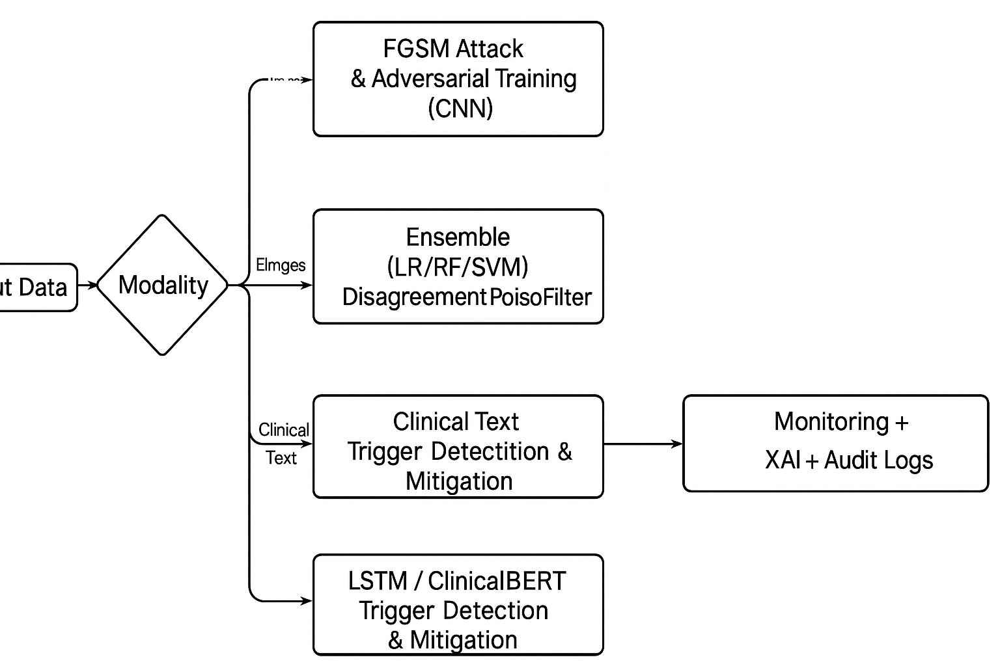

# Securing AI in Healthcare: Ensemble & Adversarial Defenses


> Cross-modality defenses for healthcare ML: **FGSM adversarial training (vision)**, **ensemble poisoning detection (tabular/EHR)**, and **trigger/backdoor mitigation (clinical text)** with LSTM & ClinicalBERT.

---

## Summary of Findings

- **Vision (CNN + FGSM):** Adversarial training recovers robustness after ε=0.1 FGSM.
- **Structured/EHR (Ensemble):** Logistic Regression + Random Forest + SVM detect poisoned rows via **disagreement**.
- **Clinical NLP (LSTM/ClinicalBERT):** Detect/mitigate trigger-word backdoors; ClinicalBERT is more resilient to rare-token triggers.

| Modality       | Clean | After Attack | After Defense |
| -------------- | ----- | ------------ | ------------- |
| CNN (Vision)   | 98.1% | 81.6%        | **91.3%**     |
| Ensemble (EHR) | 94.0% | 85.2%        | **92.6%**     |
| LSTM (Text)    | 89.4% | 70.0%        | **83.1%**     |

**Full write-up:** [`Defense_Against_ML_Attacks_Healthcare.pdf`](./Defense_Against_ML_Attacks_Healthcare.pdf)

---

## Repository Contents

```
├─ ClinicalBERT_TextTrigger_Defense.ipynb     # NLP backdoor experiments
├─ StructuredData_Ensemble_Defense.ipynb      # Ensemble poisoning detection
├─ ML_Attack_Defense_Analysis.ipynb           # Vision FGSM attack + defense
├─ Defense_Against_ML_Attacks_Healthcare.pdf  # Research paper with results
├─ requirements.txt
└─ README.md
```

---

## Quick Start

### 1) Create environment

```bash
# Option A: conda
conda create -n healthcare-secure python=3.10 -y
conda activate healthcare-secure

# Option B: venv
python -m venv .venv
# Windows: .venv\Scripts\activate
# macOS/Linux:
source .venv/bin/activate
```

### 2) Install dependencies

```bash
pip install --upgrade pip
pip install torch torchvision torchaudio --index-url https://download.pytorch.org/whl/cpu
pip install scikit-learn numpy pandas matplotlib jupyter tqdm transformers datasets
```

> If you have a CUDA GPU, install the matching CUDA build of PyTorch from pytorch.org.

### 3) Run notebooks

```bash
jupyter notebook
# Open any of:
# - ML_Attack_Defense_Analysis.ipynb
# - StructuredData_Ensemble_Defense.ipynb
# - ClinicalBERT_TextTrigger_Defense.ipynb
```

---

## Minimal Runnable Snippets

### A) Vision — FGSM Attack + Adversarial Training (PyTorch)

```python
# FGSM attack and CNN training example
```

### B) Structured — Poison Detection via Ensemble Disagreement

```python
# Ensemble disagreement detection example
```

### C) NLP — Trigger Backdoor Probe (LSTM/ClinicalBERT)

```python
# Trigger injection example
```

> Full training/evaluation flows are in the notebooks.

---

## System Diagram 



---

## Datasets (used in notebooks)

- **Vision:** MNIST (proxy for medical imaging) — auto-downloaded via `torchvision`.
- **Structured/EHR:** Synthetic tabular data with controlled label flips/feature corruption for safe experimentation.
- **Clinical Text:** Simulated clinical notes with optional rare-token triggers (e.g., `"cf"`) to probe backdoor behavior.

> Swap in real clinical datasets (e.g., MIMIC-III) only if you have proper approvals and de-identification workflows.

---

## Threat Model & Compliance

- **Attacker:** white-box during training; gray-box at inference.
- **Attacks:** evasion (adversarial inputs), poisoning (training corruption), backdoor (triggered behavior).
- **Governance:** design for **HIPAA/GDPR** compliance, employ **XAI**, maintain **audit trails**, and continuously monitor for drift and anomalies.

---

## Reproducibility Tips

- Fix seeds: `torch.manual_seed(0); np.random.seed(0)`.
- Log configs & metrics (e.g., `csv`, `wandb`, or `tensorboard`).
- Track poisoning ratios & trigger tokens per split for exact comparisons.
- Evaluate **fairness** after defenses (statistical parity difference, equalized odds, subgroup accuracy).

---

## Roadmap

- PGD / universal perturbations (vision & text).
- ClinicalBERT + ONION/STRIP sanitization.
- Federated learning (privacy-preserving, hospital-to-hospital).
- Immutable audit trails for decisions (blockchain-backed logs).

---

## Contributing

1. Fork and create a feature branch.
2. Add tests or minimally reproducible notebook cells.
3. Open a PR with a clear description and before/after metrics.

---

## License

This project is licensed under the **MIT License** — see [`LICENSE`](LICENSE).

---

## Citation

If this project helps your work, please cite:

```bibtex
@article{dietrich2025healthcaredefense,
  title   = {Securing AI in Healthcare: Ensemble and Adversarial Defense Against Poisoning and Backdoor Attacks},
  author  = {Dietrich, Melanie},
  year    = {2025},
  institution = {Stevens Institute of Technology}
}
```

---

### Author

**Melanie Dietrich**  
Department of Electrical and Computer Engineering  
Stevens Institute of Technology · mdietri1@stevens.edu
